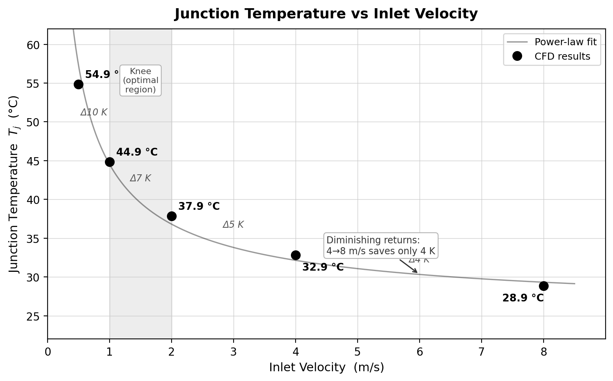
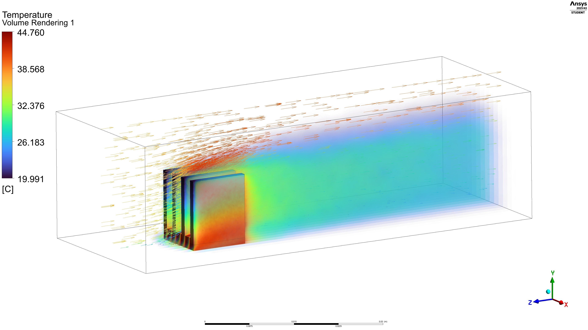
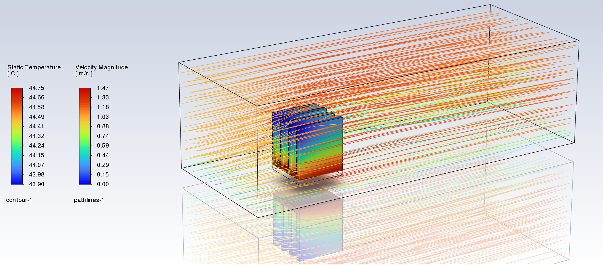

# 🌡️ CFD-Based Thermal Analysis of Forced-Air Cooled Heat Sink for IC Junction Temperature Optimization

[](https://www.ansys.com/products/fluids/ansys-fluent)
[]()
[]()

---

## 📋 Project Summary

This project presents a steady-state 3D CFD study of forced convection cooling over a finned heat sink mounted on a surface-mounted IC package. Five inlet velocity conditions (0.5–8 m/s) were simulated to characterise the relationship between airflow rate and junction temperature, identify the optimal operating regime, and quantify diminishing-return effects at high velocities. The study was conducted in **Ansys Fluent 2025 R2 (Student Edition)** using a conjugate heat transfer approach.

---

## 🔧 Problem Setup

| Parameter | Value |
|---|---|
| IC footprint | 10 mm × 10 mm |
| IC thickness | 1 mm |
| Heat sink footprint | 10 mm × 10 mm |
| Volumetric heat generation | 10,000,000 W/m³ |
| **Total IC power dissipation** | **1 W** |
| Ambient / inlet temperature | 20 °C |
| Fluid | Air (incompressible, steady) |
| Inlet velocity range | 0.5 – 8 m/s |

> **Power derivation:** Q = q‴ × V = 10⁷ W/m³ × (0.01 × 0.01 × 0.001) m³ = **1 W**

---

## 📊 Key Results

### Junction Temperature vs Inlet Velocity



The parametric sweep reveals a **power-law decay** in junction temperature with increasing inlet velocity. Critical observations:

- **0.5 m/s → 1 m/s:** ΔT = −10 K — the steepest single-step improvement across the range.
- **1 m/s → 2 m/s:** ΔT = −7 K — strong continued benefit.
- **2 m/s → 4 m/s:** ΔT = −5 K — noticeable but reducing gain.
- **4 m/s → 8 m/s:** ΔT = −4 K — doubling the velocity yields a diminishing 4 K benefit.

#### CFD Data Table

| Inlet Velocity (m/s) | T_j (°C) | ΔT from previous point (K) |
|:---:|:---:|:---:|
| 0.5 | 54.9 | — |
| 1.0 | 44.9 | −10 |
| 2.0 | 37.9 | −7 |
| 4.0 | 32.9 | −5 |
| 8.0 | 28.9 | −4 |

### 🎯 Optimal Operating Region

The shaded "knee" region (**1–2 m/s**) represents the best trade-off between cooling performance and fan power consumption. Beyond 2 m/s, the thermal benefit per unit increase in velocity — and therefore per unit of acoustic noise and pumping power — decreases significantly. This identifies **1–2 m/s as the recommended design operating range**.

---

## 🔬 Flow Field Visualisation

### Volume Rendering — Temperature Distribution (1 m/s)



The volume render at the optimal 1 m/s condition shows a sharp thermal plume rising from the heat sink surface. The hot, buoyancy-influenced near-wall region transitions rapidly to ambient conditions within a short downstream distance, confirming effective heat removal by forced convection. The fins draw cool inlet air (≈ 20 °C, deep blue) across the chip surface and exhaust a warm wake extending downstream.

---

### Pathlines Coloured by Velocity Magnitude & Surface Temperature Contours



The combined pathline and contour plot illustrates:

- **Velocity field (pathlines):** Streamlines accelerate around the fin edges (red, ≈ 1.47 m/s peak) and decelerate in the fin-channel interiors and wake region (blue, ≈ 0 m/s). The boundary layer growth along the fin walls is clearly visible.
- **Surface temperature (contour):** The upstream leading edge of the fins is coolest (≈ 43.9 °C) while the downstream base approaches the peak junction temperature (≈ 44.75 °C). This ≈ 0.85 K spanwise gradient suggests near-uniform fin efficiency, validating the fin geometry for this power level.
- **Thermal wake:** The heated wake remains contained within the channel, preventing thermal recirculation back to the inlet.

---

## 🛠️ Methodology

1. **Geometry & Meshing** — 3D CAD model of IC + finned heat sink within a rectangular wind-tunnel enclosure. Structured hex mesh with boundary layer inflation on all solid surfaces.
2. **Physics** — Conjugate heat transfer (CHT); steady-state; k-ε realizable turbulence model; pressure-velocity coupling via SIMPLE algorithm.
3. **Boundary Conditions** — Uniform velocity inlet; pressure outlet; symmetry on lateral walls; volumetric heat source applied to IC solid zone.
4. **Post-processing** — Junction temperature extracted as volume-averaged temperature of IC solid; power-law curve fitted to parametric results in Python (matplotlib).

---

## 📁 Repository Structure

```
├── README.md
├── results/
│   ├── Tj_vs_velocity.png        # Parametric sweep plot
│   ├── volume_render_3.jpg       # Ansys temperature volume render
│   └── Screenshot_pathlines.png  # Velocity pathlines + surface contours
├── mesh/
│   └── heatsink_mesh.msh         # Fluent mesh file
├── fluent/
│   └── heatsink_setup.cas.h5     # Fluent case file
└── postprocess/
    └── plot_Tj_vs_velocity.py    # Python plotting script
```

---

## 📌 Conclusions

- A **1 W IC** on a 10×10 mm footprint can be reliably maintained below **45 °C** with a modest 1 m/s forced-air flow — well within typical junction temperature limits for commercial ICs (usually T_j,max ≥ 85 °C).
- The **power-law relationship** T_j ∝ v⁻ⁿ captures the cooling behaviour accurately, enabling interpolation for any target operating velocity.
- Significant **fan power savings** are achievable by operating at the curve knee (1–2 m/s) rather than over-speeding to 8 m/s, which yields only a marginal 4 K additional benefit.
- Future work could explore **fin geometry optimisation** (height, pitch, thickness) and **heat pipe integration** to further reduce T_j at low flow rates.

---

## 🖥️ Tools Used

| Tool | Purpose |
|---|---|
| Ansys Fluent 2025 R2 (Student) | CFD solver & post-processing |
| Python / Matplotlib | Results plotting & curve fitting |
| NumPy / SciPy | Power-law regression |

---

*Simulation performed as part of an electronics thermal management study. All results obtained using Ansys Fluent 2025 R2 Student Edition.*
